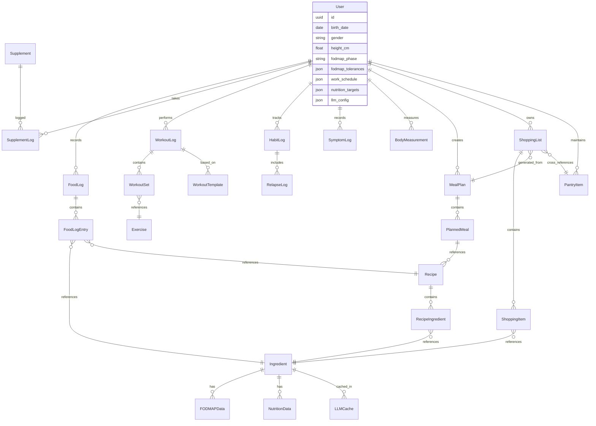

# Health Journey App — Comprehensive Plan

> **Date:** 2026-08-01
> **Author:** Oussama Kharouiche
> **Status:** Research & Planning Phase

---

## Table of Contents

1. [Vision & Scope](#1-vision--scope)
2. [FODMAP Diet Research](#2-fodmap-diet-research)
3. [Data Sources & Databases](#3-data-sources--databases)
4. [Technology Stack Recommendation](#4-technology-stack-recommendation)
5. [Feature Specification](#5-feature-specification)
6. [Data Model & Architecture](#6-data-model--architecture)
7. [Development Roadmap](#7-development-roadmap)
8. [Additional Advice & Functionalities](#8-additional-advice--functionalities)
9. [Appendix: Key References](#9-appendix-key-references)

---

## 1. Vision & Scope

### Core Purpose
A **local-first, personal health companion** that helps you:
- **Plan & monitor** a FODMAP-aware diet tailored to IBS management
- **Track** daily macro/micronutrient intake, vitamins, and supplements
- **Log & analyze** training, physical activities, and habits
- **Support** addiction quitting with day counters, relapse logs, and pattern analysis
- **Prep** meals efficiently around a hybrid work schedule (presential/remote days)

### Guiding Principles
- **Local-first** — all data stored on-device (SQLite), no server, no cloud dependency
- **Privacy-first** — your health data never leaves your device without explicit consent
- **Offline-capable** — fully functional without internet once databases are seeded
- **Cross-platform from day one** — start as a Flutter web app on laptop, same codebase compiles to iOS/Android mobile when ready
- **Evidence-based** — grounded in Monash University FODMAP research and USDA nutritional data
- **BYOK (Bring Your Own Keys)** — you control which external services to use (DeepSeek API, etc.), all optional

### How Offline Works (Important Clarification)

The app is **fully offline**. Here is the distinction:

| What | Needs Internet? | When? |
|------|----------------|-------|
| **App itself** | No | Runs entirely on your device (Flutter Web on laptop, native on mobile) |
| **Your data (logs, plans, recipes)** | No | Stored in local SQLite database |
| **Ingredient / FODMAP / Exercise databases** | No | Pre-seeded locally — they are part of the app build, shipped as SQLite data |
| **Barcode scanning (Open Food Facts)** | Yes | Only when you scan a product — one-time lookup, then cached locally |
| **LLM features (DeepSeek API)** | Yes | Only when you explicitly ask for meal analysis, recipe search, or ingredient lookup — calls go directly from your app to the LLM API |
| **Database seeding/updates** | Only once | A one-time build script fetches from USDA/Ciqual/wger, transforms the data into SQLite, and bundles it into the app — you never talk to these APIs at runtime |

**In short:** the databases are embedded in the app itself. You do not need internet to log food, plan meals, track workouts, or check FODMAP levels. Internet is only needed for LLM-powered features and barcode lookups — both are optional enhancements.

---

## 2. FODMAP Diet Research

### 2.1 What is the FODMAP Diet?

The **Low FODMAP Diet** was developed by researchers at **Monash University (Melbourne, Australia)** — *not "Monarch" as you mentioned, but close!* It is the leading evidence-based dietary therapy for IBS, effective for approximately **75% of people with IBS**.

**FODMAP** stands for:
| Letter | Meaning | Examples |
|--------|---------|---------|
| **F** | Fermentable | — |
| **O** | Oligosaccharides | Fructans (wheat, onion, garlic), GOS (legumes, chickpeas) |
| **D** | Disaccharides | Lactose (milk, yogurt, soft cheese) |
| **M** | Monosaccharides | Excess Fructose (honey, apples, mango) |
| **A** | And | — |
| **P** | Polyols | Sorbitol (stone fruits, avocado), Mannitol (mushrooms, cauliflower) |

### 2.2 The Three Phases

```
PHASE 1: ELIMINATION          PHASE 2: REINTRODUCTION        PHASE 3: PERSONALIZATION
(2–6 weeks)                   (6–8 weeks)                     (Lifelong)
┌─────────────────┐           ┌─────────────────┐             ┌─────────────────┐
│ Strict low       │           │ Systematic       │             │ Tailored diet    │
│ FODMAP diet      │ ───────► │ challenge of     │ ───────►    │ based on         │
│ All high FODMAP  │           │ each FODMAP      │             │ individual       │
│ foods removed    │           │ group one at     │             │ tolerances       │
│                  │           │ a time            │             │                  │
│ Goal: symptom    │           │ Goal: identify   │             │ Goal: long-term  │
│ relief           │           │ triggers         │             │ sustainable      │
└─────────────────┘           └─────────────────┘             └─────────────────┘
```

#### Reintroduction Protocol (Phase 2 detail)
Each FODMAP group is challenged over a **3-day period**:
- **Day 1:** Moderate (amber) serving of challenge food
- **Day 2:** High (red) serving
- **Day 3:** Higher (red) serving
- **Washout:** 2–3 days back on strict low FODMAP between challenges

**FODMAP groups to test (9 total):**
1. Lactose
2. Fructose
3. Sorbitol
4. Mannitol
5. GOS (galacto-oligosaccharides)
6. Fructan — Wheat
7. Fructan — Onion
8. Fructan — Garlic
9. Fructan — Fruit

### 2.3 Traffic Light System

| Level | Color | Meaning | App Action |
|-------|-------|---------|------------|
| **Low** | 🟢 Green | Safe to eat | Allow freely during elimination |
| **Moderate** | 🟡 Amber | Caution — limit portions | Warn user, suggest max serving |
| **High** | 🔴 Red | Avoid | Flag/hide during elimination phase |

### 2.4 FODMAP Stacking Warning

**Critical concept:** You can eat two green (low FODMAP) foods and still trigger symptoms if the combined FODMAP load exceeds your tolerance. This is called **FODMAP stacking**. The app should track cumulative FODMAP load per meal and per day.

---

## 3. Data Sources & Databases

### 3.1 FODMAP Food Database

| Source | Type | Coverage | Format |
|--------|------|----------|--------|
| [oseparovic/fodmap_list](https://github.com/oseparovic/fodmap_list) | Open Source (GitHub) | ~300+ foods with FODMAP sub-type breakdown | JSON |
| [zarhaselene/fodmap-recipe](https://github.com/zarhaselene/fodmap-recipe) | Open Source (GitHub) | Foods + recipes + resources | JSON files |
| [Monash FODMAP App](https://www.monashfodmap.com/ibs-central/i-have-ibs/get-the-app/) | Official App ($7.99) | Most comprehensive + certified products | Proprietary (no public API, no export) |

> **Note on Monash App:** The Monash app stores its database internally on your phone (it works offline too), but there is **no public API, no export function, and no way to extract its data programmatically**. You cannot integrate it directly. The app is useful as a manual cross-reference — you can look up a food there and add it to your own database. The open-source community JSON databases below are our best source for seed data.

**Strategy:** Seed the app database from the open-source `fodmap_list` JSON (community-maintained, cross-referenced with Monash data). You can always manually add or correct entries by checking against the Monash app. Each food entry should store:

```json
{
  "id": "uuid",
  "name": "Almond butter",
  "fodmap_level": "low",          // low | moderate | high
  "category": "Nuts & Seeds",
  "serving_size": "1 tbsp",
  "serving_grams": 16,
  "fodmap_details": {
    "oligos": 0,    // 0=low, 1=moderate, 2=high
    "fructose": 0,
    "polyols": 0,
    "lactose": 0
  },
  "fodmap_groups": ["fructans"],  // which FODMAP groups are present
  "source": "monash_2025"
}
```

### 3.2 Nutritional Composition Database

| Source | Type | Coverage | Nutrients | Access |
|--------|------|----------|-----------|--------|
| [USDA FoodData Central](https://fdc.nal.usda.gov/) | US Government (free) | 380,000+ foods | 150+ nutrients | REST API (free key) |
| [ANSES Ciqual](https://ciqual.anses.fr/) | French Government (free) | 3,185 foods | 60+ nutrients | Downloadable CSV / SQLite |
| [Open Food Facts](https://world.openfoodfacts.org/) | Open Source | 3M+ products | Full nutrition labels | REST API (free) |
| [Nutritionix](https://developer.nutritionix.com/) | Commercial | 1M+ foods | Full macro/micro | REST API (free tier) |

**Strategy:** All databases are **pre-seeded locally at build time** — no runtime API calls needed:

1. **Primary:** Download **ANSES Ciqual** CSV (French/European foods, 3,185 entries) + **USDA FoodData Central** JSON dump (global, 380K+ entries) → transform with a one-time **Dart seed script** → bundled as SQLite databases shipped with the app. No runtime loading — the data is already there on first launch.
2. **Barcode scanning:** Only when online — calls **Open Food Facts** API (free, no key required). Results are cached into your local database so the same product works offline next time
3. **LLM-powered lookup:** When you search for a food not in the database, the LLM (DeepSeek) can fetch nutritional info from its training data and populate it into your local database
4. **Manual entry:** Always available as fallback — type in nutrition data yourself

#### Nutritional Fields to Track (per 100g and per serving):
```
Macronutrients:         Minerals:              Vitamins:
- Energy (kcal/kJ)      - Calcium (Ca)         - Vitamin A (retinol)
- Protein (g)           - Iron (Fe)            - Vitamin B1 (thiamine)
- Total Fat (g)         - Magnesium (Mg)       - Vitamin B2 (riboflavin)
  - Saturated (g)       - Phosphorus (P)       - Vitamin B3 (niacin)
  - Mono-unsaturated    - Potassium (K)        - Vitamin B5 (pantothenic)
  - Poly-unsaturated    - Sodium (Na)          - Vitamin B6 (pyridoxine)
- Carbohydrates (g)     - Zinc (Zn)            - Vitamin B9 (folate)
  - Sugars (g)          - Copper (Cu)          - Vitamin B12 (cobalamin)
  - Fiber (g)           - Manganese (Mn)       - Vitamin C
  - Starch (g)          - Selenium (Se)        - Vitamin D
- Water (g)             - Iodine (I)           - Vitamin E
- Alcohol (g)                                   - Vitamin K
```

### 3.2b Daily Reference Intakes — Medical Sources

The app tracks your intake against **official medical reference values**, not arbitrary targets. Since you are a French adult male, the primary source is **ANSES 2021** (Agence nationale de sécurité sanitaire de l'alimentation), which published updated Population Reference Intakes (PRI) for the French population — the first full revision since 2001. Where ANSES provides only Adequate Intakes (AI) or no value, **EFSA DRVs** and **EU NRV 1169/2011** are used as fallbacks.

#### Macronutrient Targets (Adult Male, ~2500 kcal)

| Nutrient | Target | Source | Note |
|----------|--------|--------|------|
| **Energy** | 2,500 kcal/day | EFSA AR | Adjusts based on your weight, age, and activity level (calculated by the app using Mifflin-St Jeor × activity factor) |
| **Protein** | 0.83 g/kg bodyweight | EFSA PRI 2012 | For an 80kg male: ~66g. Higher if training (1.6–2.0 g/kg for strength athletes) |
| **Total Fat** | 20–35% of energy | EFSA RI | At 2500 kcal: 56–97g |
| **Saturated Fat** | <10% of energy | EFSA/WHO | As low as possible. At 2500 kcal: <28g |
| **Carbohydrates** | 45–60% of energy | EFSA RI | At 2500 kcal: 281–375g |
| **Added Sugars** | <10% of energy | WHO | At 2500 kcal: <63g (ideally <5% = <31g) |
| **Fiber** | 30 g/day | ANSES AI | EU NRV: 25g. ANSES recommends 30g |
| **Water** | 2.5 L/day | EFSA AI | Adult male. +0.5–1.0L per hour of exercise |

#### Vitamins — Daily Reference Intakes (Adult Male)

| Vitamin | Target | Unit | Source | Notes |
|---------|--------|------|--------|-------|
| **Vitamin A** | 750 | μg RE | ANSES 2021 PRI | Includes retinol + carotenoids |
| **Vitamin B1 (Thiamine)** | 0.1 mg/MJ | mg | ANSES 2021 PRI | ~1.05 mg at 2500 kcal. Expressed per energy intake |
| **Vitamin B2 (Riboflavin)** | 1.6 | mg | ANSES 2021 PRI | — |
| **Vitamin B3 (Niacin)** | 1.6 mg NE/MJ | mg NE | ANSES 2021 PRI | ~16.8 mg at 2500 kcal. Includes tryptophan conversion |
| **Vitamin B5 (Pantothenic)** | 6 | mg | ANSES 2021 AI | Adequate Intake (no PRI defined) |
| **Vitamin B6 (Pyridoxine)** | 1.7 | mg | ANSES 2021 PRI | UL: 25 mg/day |
| **Vitamin B8 (Biotin)** | 40 | μg | ANSES 2021 AI | — |
| **Vitamin B9 (Folate)** | 330 | μg DFE | ANSES 2021 PRI | 600 μg for women who could become pregnant |
| **Vitamin B12 (Cobalamin)** | 4.0 | μg | ANSES 2021 AI | EU NRV is only 2.5 μg — ANSES is more conservative |
| **Vitamin C** | 110 | mg | EFSA PRI 2013 | ANSES value aligns with EFSA. Smokers: +35 mg |
| **Vitamin D** | 15 | μg | EFSA AI 2016 | ANSES: 15 μg. From all sources (sun + food + supplements). Many adults need supplementation |
| **Vitamin E** | 12 | mg | EU NRV 1169/2011 | EFSA AI: 13 mg (men) |
| **Vitamin K** | 75 | μg | EU NRV 1169/2011 | EFSA AI: 70 μg |

#### Minerals & Trace Elements — Daily Reference Intakes (Adult Male)

| Mineral | Target | Unit | Source | Notes |
|---------|--------|------|--------|-------|
| **Calcium** | 950 | mg | ANSES 2021 PRI | Higher than EU NRV (800 mg). Dairy, sardines, leafy greens |
| **Magnesium** | 350 | mg | ANSES 2021 PRI | Also EU NRV value. Nuts, seeds, dark chocolate, legumes |
| **Iron** | 7 | mg | ANSES 2021 PRI | Male value. Women with menstruation: ~16 mg. Heme iron (meat) absorbed ~25%, non-heme (plants) ~5-12% |
| **Zinc** | 15 | mg | ANSES 2021 PRI | Higher than EU NRV (10 mg). Assumes 30% absorption. Oysters, red meat, pumpkin seeds |
| **Phosphorus** | 700 | mg | EU NRV 1169/2011 | Widespread in food — deficiency is rare |
| **Potassium** | 2,000 | mg | EU NRV 1169/2011 | EFSA AI: 3,500 mg. Bananas, potatoes, spinach, avocado |
| **Sodium** | <2,000 | mg | WHO guideline | This is a LIMIT, not a target. Most people exceed it |
| **Copper** | 1.0 | mg | EU NRV 1169/2011 | EFSA AI: 1.6 mg (men) |
| **Manganese** | 2.0 | mg | EU NRV 1169/2011 | EFSA AI: 3.0 mg |
| **Selenium** | 55 | μg | ANSES 2021 PRI | Brazil nuts (1 nut = ~95 μg!), fish, eggs |
| **Iodine** | 150 | μg | EU NRV 1169/2011 | EFSA AI: 150 μg. Iodized salt, seafood, dairy |

> **Sources:**
> - **ANSES 2021** — "Les références nutritionnelles en vitamines et minéraux" (French Agency for Food, Environmental and Occupational Health & Safety). The official French government reference.
> - **EFSA** — European Food Safety Authority Dietary Reference Values (scientific opinions 2012–2019).
> - **EU NRV 1169/2011** — Regulation on food information to consumers, Annex XIII. Labelling reference values.
> - **WHO** — World Health Organization guidelines on sugars and sodium.

#### Why Weekly Average Is More Important Than Daily

**Most nutrients are regulated by the body over days to weeks, not hours.** Your body stores fat-soluble vitamins (A, D, E, K) in the liver and adipose tissue — a low day is fine if the week averages out. Water-soluble vitamins (B, C) have shorter half-lives but are still buffered. Iron status reflects weeks of intake, not a single meal. Even protein synthesis responds to weekly volume, not daily precision.

The app's primary nutritional view should be the **rolling 7-day average**, not a single day:

```
                    Mon   Tue   Wed   Thu   Fri   Sat   Sun
Vitamin C (mg)      85    120   45    160   70    90    110
Daily target: 110   ❌    ✅    ❌    ✅    ❌    ❌    ✅    ← 4/7 days "failed"

Weekly average: 97 mg/day ← ❌ Below 110 (you're trending low)
```

A daily-goal-only view would show 4 failures out of 7 days, creating a misleading picture. The weekly average reveals the real trend: you're at 88% of target — not ideal but not alarming, and it tells you to add one more vitamin-C-rich food to your rotation.

**Exceptions that ARE daily-critical:**
- **Water** — dehydration happens in hours
- **Sodium** — acute blood pressure effects
- **Pre-workout nutrition** — timing matters for performance
- **FODMAP load** — triggers are meal-triggered, not weekly

### 3.3 Recipe Database

| Source | Type | Coverage | Features |
|--------|------|----------|----------|
| [Gourd](https://github.com/nickysemenza/gourd) | Open Source (Go) | Recipe DB + USDA mapping | Ingredient parser, scaling, OpenAPI |
| [recipe-macros-scraper](https://github.com/harrisonfaulkner/recipe-macros-scraper) | Open Source (Python) | 646+ recipe sites | URL import, auto macro calculation |
| User-created | Custom | Personal recipes | Manual entry with ingredient linking |

**Strategy:** Build a flexible recipe system with LLM assistance:

**Recipe Search & Creation Flow:**
1. **LLM-powered recipe search** — "Find me a high-protein, low-FODMAP lunch under 500 calories" → DeepSeek returns recipe ideas with ingredients and instructions
2. **Auto-ingredient matching** — the LLM cross-references recipe ingredients against your local database; any ingredient not found gets flagged for enrichment (see LLM ingredient enrichment below)
3. **Manual recipe creation** — build your own by linking to the ingredient database (auto-calculates nutrition + FODMAP levels)
4. **Recipe import** — paste a URL, the scraper extracts ingredients and instructions, then maps them to your local database

**Recipe features:**
- Recipes scale automatically when servings are adjusted
- Tags: `quick-breakfast` (≤10 min), `meal-prep`, `low-fodmap`, `high-protein`, `vegetarian`, `microwave-friendly`, `batch-cook`
- **FODMAP-aware search** — filter/search by FODMAP level per serving: "show me only green (low) FODMAP recipes"
- **Nutrition-range search** — "recipes with 30–40g protein, under 20g fat, under 400 kcal"
- Recipes auto-calculate: nutrition per serving, FODMAP level per serving, cost estimate, prep+cook time

**LLM Ingredient Enrichment Flow:**
When a recipe (from LLM search, URL import, or manual entry) references an ingredient not in your local database:
1. The app sends the ingredient name to DeepSeek: *"What is the full nutritional composition of X per 100g? Include all macros, minerals, and vitamins. Also what is its FODMAP level (low/moderate/high) and which FODMAP groups? Return as structured JSON."*
2. The LLM returns the data in a structured format
3. The app populates your local database with the new ingredient, flagged as `source: "llm_enriched"`
4. You can review and edit before saving (LLM data is good but not infallible)
5. Once saved, the ingredient is available offline forever

### 3.4 Exercise Database

| Source | Type | Coverage | Access |
|--------|------|----------|--------|
| [wger](https://github.com/wger-project/wger) | Open Source (AGPL-3.0) | 690+ exercises with muscles, equipment, images | Public REST API |
| [Hermes Fitness Skill](https://github.com/NousResearch/hermes-agent) | Open Source (MIT) | Wraps wger + USDA + TDEE calculators | Python reference |
| Nutritionix | Commercial | Natural language → calories | REST API |

**Strategy:** Seed exercise database from wger's public API. Store:
- Exercise name, category (arms/legs/abs/chest/back/shoulders/calves/cardio)
- Primary & secondary muscles worked
- Equipment needed
- MET (Metabolic Equivalent of Task) value for calorie estimation
- Allow custom exercise creation

#### Calorie Burn Calculation:
```
Calories burned = MET × weight(kg) × duration(hours)
```
Using the Compendium of Physical Activities MET values.

### 3.5 Vitamin & Supplement Database

Build a custom supplement database since no comprehensive open-source option exists. **LLM-assisted entry** makes this practical:

**Adding a supplement (LLM-powered flow):**
1. Type the supplement name: *"Magnesium Bisglycinate Now Foods"*
2. DeepSeek API call: *"What are the nutritional details of Magnesium Bisglycinate by Now Foods? Return dosage per capsule, nutrients provided, recommended timing, known interactions, and typical serving size. JSON format."*
3. The LLM returns structured data — review and confirm, it's saved locally
4. Manual entry is always available as fallback

**Tracked fields:**
- Supplement name, brand, dosage per unit, unit type (mg/µg/IU/g)
- Nutrients provided per dose (linked to your nutrition targets)
- Daily intake schedule (morning/noon/evening/bedtime, with/without food, specific days)
- Stock tracking (pills remaining, refill reminders at configurable threshold)
- Interaction warnings between supplements (e.g., "Calcium reduces iron absorption — space by 2 hours")
- Adherence streak and % compliance
- Notes: how you feel, any side effects noticed

**Why LLM is good for this:** Supplement info changes by brand — there is no single public database. The LLM has been trained on product labels, health databases, and medical literature. It gives you a solid starting point that you can verify once and keep forever.

---

## 4. Technology Stack Recommendation

### 4.1 Recommended: Flutter + Drift (SQLite) — Cross-Platform From Day One

**Why Flutter for this specific project:**

The app starts on your **laptop browser** but will become a **mobile app** (Android/iOS). Flutter compiles to **both from a single codebase** — no rewrite, no shared-logic gymnastics.

| Requirement | How Flutter Handles It |
|-------------|----------------------|
| **Starts on laptop browser** | `flutter run -d chrome` — works today. Flutter Web via CanvasKit/WASM renders identically to mobile |
| **Mobile later** | Same codebase → `flutter build ios` + `flutter build apk`. Zero additional work |
| **Local-first, offline** | Drift (SQLite) — real SQL, unlimited storage, mature migrations. Works on all platforms including web via `sqlite3` WASM |
| **LLM integration (DeepSeek)** | Dart's `http` package — straightforward REST calls. OpenAI-compatible API is just POST with JSON |
| **Single developer** | One language (Dart), one framework, one codebase. No context-switching between web and mobile stacks |

**Honest trade-offs of Flutter Web for a personal app:**

| Concern | Reality for YOUR use case |
|---------|--------------------------|
| **Initial load ~2-4 MB** | You open the app once and keep using it — not a landing page. Irrelevant for a daily-use tool |
| **No SEO** | It's a personal app, not a public website. Nobody needs to Google it |
| **Scrolling feels slightly different** | Noticeable on content-heavy marketing sites. For a data-entry dashboard with forms, charts, and lists — imperceptible |
| **Mobile path** | ✅ This is where Flutter destroys the competition. Same code → native iOS + Android. No React Native rewrite, no shared-core monorepo, no adapter layer |

**If this were a public SaaS product with landing pages and SEO**, I'd recommend Next.js. For a **personal daily-use health tool that will become a mobile app**, Flutter is the pragmatic choice.

### 4.2 Tech Stack Detail

```
┌─────────────────────────────────────────────────────────┐
│                    PRESENTATION LAYER                     │
│  Flutter UI (Material 3) + Riverpod state management     │
│  → Same widgets render on web, iOS, and Android          │
├─────────────────────────────────────────────────────────┤
│                     STATE LAYER                           │
│  Riverpod providers (AsyncNotifier / Stream / Future)    │
│  + Drift reactive queries (real-time DB → UI updates)    │
├─────────────────────────────────────────────────────────┤
│                    SERVICE LAYER                          │
│  Pure Dart — NO Flutter dependency in core logic         │
│  NutritionEngine, FODMAPEngine, MealPlanner,             │
│  WorkoutTracker, HabitTracker, LLMService,               │
│  ShoppingListService, PantryService, AnalyticsEngine     │
├─────────────────────────────────────────────────────────┤
│                     DATA LAYER                            │
│  Drift (SQLite ORM) — type-safe SQL, migrations,         │
│  reactive streams, full-text search (FTS5)               │
│  + Hive for key-value cache/preferences                  │
├─────────────────────────────────────────────────────────┤
│                   PERSISTENCE                             │
│  SQLite database file — all user data + app databases    │
│  + SharedPreferences/Hive (settings, API keys)           │
│  + JSON export/import (backup to laptop disk)            │
│  (Future mobile: biometric lock on app)                  │
└─────────────────────────────────────────────────────────┘
```

### 4.3 Project Structure

```
health-app/
├── lib/
│   ├── app.dart                        # MaterialApp + router setup
│   ├── main.dart                       # Entry point (web + mobile)
│   │
│   ├── core/                           # Pure Dart — NO Flutter imports
│   │   ├── services/                  # All business logic
│   │   │   ├── nutrition_engine.dart
│   │   │   ├── fodmap_engine.dart
│   │   │   ├── meal_planner.dart
│   │   │   ├── workout_tracker.dart
│   │   │   ├── habit_tracker.dart
│   │   │   ├── llm_service.dart       # DeepSeek / OpenAI-compatible
│   │   │   ├── shopping_list_service.dart
│   │   │   ├── pantry_service.dart
│   │   │   └── analytics_engine.dart
│   │   ├── models/                    # Data classes + JSON serialization
│   │   ├── database/                  # Drift tables, DAOs, migrations
│   │   │   ├── database.dart          # Drift database definition
│   │   │   ├── tables/                # Table definitions
│   │   │   └── daos/                  # Data access objects
│   │   └── utils/                     # Calculators, formatters, constants
│   │
│   ├── features/                      # UI features (Flutter widgets)
│   │   ├── food_diary/
│   │   ├── meal_planner/
│   │   ├── shopping_list/
│   │   ├── supplement_tracker/
│   │   ├── workout_logger/
│   │   ├── habit_tracker/
│   │   ├── symptom_logger/
│   │   ├── insights/
│   │   └── settings/
│   │
│   └── shared/                        # Shared widgets, theme, navigation
│       ├── widgets/
│       ├── theme/
│       └── router/
│
├── assets/
│   └── seed_data/                     # Pre-built SQLite databases
│       ├── ingredients.db             # USDA + Ciqual merged
│       ├── fodmap.db                  # From open-source FODMAP DB
│       └── exercises.db              # From wger API
│
├── scripts/                           # One-time build scripts
│   ├── seed_ingredients.dart          # Downloads + merges USDA/Ciqual
│   ├── seed_fodmap.dart              # Transforms fodmap_list JSON → SQLite
│   └── seed_exercises.dart           # Fetches wger API → SQLite
│
├── pubspec.yaml
├── web/                               # Flutter Web output target
└── test/
```

> **Key architectural decision:** `lib/core/` is pure Dart with **zero Flutter imports**. Services like `NutritionEngine` and `LLMService` don't know they're running in a Flutter app — they operate on data models and return results. This means the exact same business logic runs on web, iOS, and Android with no platform-specific code.

### 4.4 Key Dependencies (pubspec.yaml)

```yaml
dependencies:
  flutter:
    sdk: flutter
  
  # State management
  flutter_riverpod: ^2.x
  riverpod_annotation: ^2.x
  
  # Local database (SQLite)
  drift: ^2.x                    # Type-safe SQLite ORM
  sqlite3_flutter_libs: ^0.x     # SQLite native libs
  drift_flutter: ^0.x            # Drift Flutter helpers
  
  # Key-value storage
  hive_flutter: ^2.x             # Preferences, API keys, cache
  
  # Charts & visualization
  fl_chart: ^0.x                 # Nutrition breakdown, progress charts
  
  # HTTP (LLM API calls)
  http: ^1.x
  dio: ^5.x                      # Advanced HTTP with interceptors (optional)
  
  # Local notifications
  flutter_local_notifications: ^x
  
  # File I/O (backup/export)
  path_provider: ^x
  share_plus: ^x                 # Share/export data
  file_picker: ^x                # Import data
  
  # Barcode scanning (mobile)
  mobile_scanner: ^x             # Camera barcode for Open Food Facts
  
  # UI utilities
  intl: ^x                       # Date/number formatting
  google_fonts: ^x
  
  # Background processing
  workmanager: ^x                # Periodic tasks (reminders, daily resets)
```

### 4.5 Why Drift (SQLite) over Hive or IndexedDB

| Aspect | Drift (SQLite) | Hive (NoSQL) | SharedPreferences |
|--------|---------------|--------------|-------------------|
| **Query power** | Full SQL with joins, FTS, aggregates | Key-value only | Key-value, strings only |
| **Relational data** | ✅ Foreign keys, cascades, indexes | ❌ No relations | ❌ No relations |
| **Migrations** | ✅ Typed, tested migration system | ✅ Manual versioning | ❌ No migration support |
| **Reactivity** | ✅ Streams — UI updates on DB change | ✅ ValueListenable | ❌ Read-only on load |
| **Web support** | ✅ WASM (sql.js under the hood) | ✅ IndexedDB backend | ✅ Browser localStorage |
| **Storage limit** | ✅ Unlimited (filesystem on mobile) | ✅ Unlimited | ~5-10 MB |
| **Full-text search** | ✅ FTS5 — instant ingredient search | ❌ Manual filtering | ❌ No search |

**Verdict:** Drift is the right choice. This app is inherently relational — ingredients have nutrition data, recipes contain ingredients, food logs reference both, meal plans generate shopping lists. SQL with foreign keys and joins makes this natural. Drift's reactive streams mean your nutritional dashboard updates in real time as you log food, with zero manual wiring.

### 4.6 How to Run It

```
┌──────────────────────────────────────────┐
│  On your laptop (web)                     │
│  ─────────────────────────────────────── │
│  flutter run -d chrome                    │
│  → Opens in Chrome, fully functional     │
│  → Hot reload in <1s                     │
│  → Uses SQLite via WASM                  │
│                                          │
│  Or build static files:                   │
│  flutter build web                        │
│  → build/web/ folder                     │
│  → Serve with any HTTP server            │
│    (python -m http.server, npx serve)    │
│                                          │
│  On mobile (future):                      │
│  ─────────────────────────────────────── │
│  flutter run -d ios     → iPhone        │
│  flutter run -d android → Android        │
│  flutter build ios      → App Store     │
│  flutter build appbundle → Google Play   │
└──────────────────────────────────────────┘
```

For a personal app, `flutter run -d chrome` is all you need. It launches your app in a browser tab using CanvasKit — identical to how it would look on mobile, just bigger.

### 4.7 Path to Mobile (When You're Ready)

This is where Flutter pays off:

1. **No code changes needed** in `lib/core/` — all business logic, database, and LLM services work identically
2. **UI adapts automatically** — Flutter widgets render natively. You may tweak layouts for smaller screens (responsive breakpoints are built in)
3. **SQLite becomes native** — Drift uses `sqlite3_flutter_libs` (native C SQLite) on mobile instead of WASM. Same schema, same queries, faster performance
4. **Barcode scanning works** — `mobile_scanner` uses the device camera (not available on web)
5. **Notifications become native** — `flutter_local_notifications` taps into iOS/Android notification systems

**Code reuse:** **~95%** — everything except a few platform-specific tweaks (barcode scanning, notifications, biometrics).

---

## 5. Feature Specification

### 5.1 Module: Food & Diet Tracking

#### 5.1.1 Food Diary
```
┌──────────────────────────────────┐
│  TODAY - Wednesday, Aug 1        │
│                                  │
│  🥐 Breakfast    8:00 AM        │
│  ├─ Oatmeal (40g)        180 kcal│
│  ├─ Blueberries (50g)     28 kcal│
│  └─ Lactose-free milk     65 kcal│
│     FODMAP: 🟢 All green        │
│                                  │
│  🥗 Lunch        12:30 PM       │
│  ├─ Grilled chicken...          │
│  └─ ...                         │
│                                  │
│  🍎 Snack        4:00 PM        │
│  └─ ...                         │
│                                  │
│  🍝 Dinner       7:30 PM        │
│  └─ ...                         │
│                                  │
│  💊 Supplements                  │
│  ├─ Vitamin D 2000IU   ✓       │
│  └─ Magnesium 300mg    ✓       │
│                                  │
│  [+ Add Meal]  [+ Add Supplement]│
└──────────────────────────────────┘
```

#### 5.1.2 FODMAP Phase Manager
- **Phase selector:** Elimination / Reintroduction / Personalization
- **Elimination mode:** Auto-flags high-FODMAP foods, suggests alternatives
- **Reintroduction mode:** Guides the 3-day challenge protocol per FODMAP group
  - Shows which FODMAP group is being challenged
  - Day counter, dose reminders
  - Symptom logging after each dose
  - Washout day tracking
- **Personalization mode:** Builds your personal tolerance profile
  - "Your FODMAP Map" — which groups you tolerate and at what doses

#### 5.1.3 Meal Planner
```
┌──────────────────────────────────┐
│  WEEKLY MEAL PLAN                │
│  Aug 4 – Aug 10, 2026            │
│                                  │
│        Mon  Tue  Wed  Thu  Fri   │
│  Work:  🏢   🏢   🏠   🏢   🏢  │
│                                  │
│  Bfast 🥐   🥐   🥞   🥐   🥐  │
│  Lunch 🥗   🥗   🍜   🥗   🥗  │
│  Snack 🍎   🍎   🥜   🍎   🍎  │
│  Din.  🍝   🍛   🥘   🍝   🍕  │
│                                  │
│  Meal Prep Day: Sunday           │
│  └─ Prep: chicken, rice, veggies │
│                                  │
│  [Generate Plan] [Edit] [Shop List]│
└──────────────────────────────────┘
```

**Work schedule integration:**
- Mark days as "presential" (🏢) or "remote" (🏠)
- On presential days: auto-suggest **microwave-reheatable** meals (work has a microwave) — tag meals as `microwave-friendly`
- On remote days: allow cooking-heavy meals, fresh prep
- **"Quick breakfast"** tag for options ≤10 min prep — optimized for rushed mornings
- **"Meal prep"** tag for batch-cook recipes you make on Sunday for the week ahead

#### 5.1.4 Nutritional Dashboard

The dashboard is built around the **rolling 7-day average** as the primary health metric, with daily detail available on drill-down.

```
┌──────────────────────────────────────────────────────────┐
│  NUTRITION — Rolling 7-Day Average (Jul 28 – Aug 3)      │
│                                                          │
│  MACRONUTRIENTS                            vs Targets    │
│  ┌──────────────────────────────────────────────────────┐│
│  │ Calories  ████████████████░░░░  2,340 / 2,500       ││
│  │ Protein   ████████████████████░  148g / 160g  ⚠️ -8% ││
│  │ Carbs     ████████████████░░░░  287g / 281-375g ✅  ││
│  │ Fat       ██████████████░░░░░░   68g / 56-97g   ✅  ││
│  │ Fiber     ████████████████████   28g / 30g     ⚠️    ││
│  │ Water     ████████████████████  2.3L / 2.5L   ⚠️    ││
│  └──────────────────────────────────────────────────────┘│
│                                                          │
│  MICRONUTRIENTS (% of weekly target)                     │
│  ┌──────────────────────────────────────────────────────┐│
│  │ Calcium    ██████████░░  52% ⚠️ LOW — 3-week trend ↓││
│  │ Iron       ██████████████ 72% ✅                      ││
│  │ Magnesium  ████████████████ 81% ✅                    ││
│  │ Zinc       ██████████░░  48% 🔴 LOW — 2-week trend ↓││
│  │ Vitamin D  ████████████████████ 95% ✅ (supplemented)││
│  │ Vitamin C  ██████████████ 68% ⚠️                      ││
│  │ Vitamin B12████████████████████ 102% ✅               ││
│  │ Folate     ██████████████ 71% ✅                      ││
│  │ Selenium   ████████████████████ 89% ✅                ││
│  │ ...more    [Expand]                                   ││
│  └──────────────────────────────────────────────────────┘│
│                                                          │
│  TREND INDICATORS                                        │
│  ↓ Iron down 12% over 3 weeks  → "Add red meat, lentils"│
│  ↑ Sodium trending up          → "Watch processed foods" │
│  ✓ Protein steadily improving since adding whey          │
│                                                          │
│  [View Daily Breakdown]  [View Monthly Trends]            │
└──────────────────────────────────────────────────────────┘
```

**Key design decisions:**

1. **Weekly average is the default view.** This aligns with how the body actually regulates nutrients — your liver stores vitamin A for weeks, your iron status reflects months of intake, and even water-soluble vitamins are buffered over days.

2. **Daily drill-down is one tap away.** Each nutrient bar expands to show the 7 daily values as a sparkline, so you can spot patterns: "I eat well on weekends but poorly on presential work days."

3. **Trend arrows matter more than single values.** A weekly average of 52% for calcium is flagged more urgently if it's been declining for 3 consecutive weeks vs stable at 52%. The app tracks **3-week and 8-week trend directions** for every nutrient.

4. **Color coding by severity:**
   - 🟢 ≥80% of target — adequate
   - 🟡 60–79% — borderline, pay attention
   - 🔴 <60% — deficient, needs action
   - Trend ↓ or ↑ arrow when 3-week slope exceeds threshold

5. **Actionable alerts, not just numbers.** Instead of "Calcium: 495mg", the app says: *"Calcium: 52% of target. To close the gap this week, add one of: 200g yogurt (+350mg), 30g parmesan (+330mg), or 100g sardines (+380mg)."* These suggestions are auto-generated from foods you've logged before.

6. **FODMAP heatmap** (per-meal, not weekly — because FODMAP triggers ARE meal-triggered):
   ```
   Mon breakfast: 🟢  Mon lunch: 🟡  Mon dinner: 🟢
   Tue breakfast: 🟢  Tue lunch: 🟢  Tue dinner: 🔴 ← Stacking!
   ```
   This remains per-meal because FODMAP tolerance is not weekly — it's about what hits your gut in one sitting.

7. **Supplements are factored in.** Your vitamin D target may be met at 95% because you log 2000 IU daily. The dashboard shows "from food" vs "from supplements" as stacked bars so you know what's natural vs supplemented.

#### 5.1.5 Recipe Manager
- Create recipes with linked ingredient database
- Auto-calculate: nutrition per serving, FODMAP level per serving, cost estimate
- Tag system: `quick`, `meal-prep`, `low-fodmap`, `high-protein`, `vegetarian`, `batch-cook`
- Step-by-step cooking mode with timers
- Scale servings (½x, 1x, 2x, 3x) — ingredients and nutrition scale automatically

#### 5.1.6 Shopping Cart & List

```
┌──────────────────────────────────────┐
│  SHOPPING LIST — Week Aug 4-10       │
│                                      │
│  🔍 [Add item manually...]           │
│                                      │
│  🥬 PRODUCE                          │
│  ☐ Spinach — 400g                    │
│  ☐ Blueberries — 200g               │
│  ☐ Carrots — 500g (4 medium)        │
│  ☐ Bananas — 6                       │
│                                      │
│  🥩 MEAT & FISH                      │
│  ☐ Chicken breast — 800g (4 pieces) │
│  ☐ Salmon fillet — 300g (2 pieces)  │
│                                      │
│  🥛 DAIRY & ALTERNATIVES             │
│  ☐ Lactose-free milk — 1L           │
│  ☐ Greek yogurt (lactose-free) — 2  │
│  ⚠️ Cheddar cheese — FODMAP: 🟢✅   │
│                                      │
│  🌾 GRAINS & PASTA                   │
│  ☐ Jasmine rice — 1kg               │
│  ☐ Gluten-free pasta — 500g         │
│  ☐ Oats (unprocessed) — 500g 🟢    │
│                                      │
│  🥫 PANTRY                           │
│  ☐ Canned tomatoes — 2 cans         │
│  ☐ Olive oil — already have ✅      │
│                                      │
│  [✓ Check All]  [Share List]  [Print]│
│  [Export to Notes/Reminders]         │
└──────────────────────────────────────┘
```

**Shopping Cart Flow:**

```
Weekly Meal Plan ──► [Generate Shopping List] ──► Shopping Cart
                                                        │
                                          ┌─────────────┴─────────────┐
                                          ▼                           ▼
                                   Aggregate all recipe       Cross-reference with
                                   ingredients × servings     your pantry inventory
                                          │                           │
                                          └───────────┬───────────────┘
                                                      ▼
                                              Final Shopping List
                                              (only what you need)
```

**Features:**
- **Auto-generated** from the weekly meal plan — all recipe ingredients × planned servings
- **Pantry-aware** — mark staples you already have (olive oil, salt, rice), they get excluded from the list. Maintain a running pantry inventory
- **Store-section grouping** — produce, meat/dairy, grains/pasta, pantry, frozen, spices
- **Quantity aggregation** — if 3 meals use onions, it sums: "Onions — 3 medium"
- **FODMAP safety check** — each item shows its FODMAP traffic light; if you're in Elimination phase, high-FODMAP items get flagged with ⚠️
- **Price estimates** (optional) — rough cost per item and total estimated grocery bill
- **Manual add** — "Oh I also need paper towels" — type anything not from the meal plan
- **Check-as-you-shop** — tap to check off items while at the store (mobile-friendly when you use it on your phone browser)
- **Remember past purchases** — items you bought before appear as suggestions
- **Share/Export** — send the list to Apple Notes, Reminders, or copy as text
- **Print view** — clean print-friendly layout for old-school shopping
- **Reusable templates** — save a "weekly staples" list (things you always buy)

**Pantry Inventory (linked feature):**
```
┌──────────────────────────────────────┐
│  PANTRY                              │
│                                      │
│  Olive oil — ✅ 500ml remaining      │
│  Jasmine rice — ✅ ~800g remaining   │
│  Soy sauce — ⚠️ Running low          │
│  Canned tomatoes — 0 (used last one) │
│                                      │
│  [+ Add Item] [Update Stock]         │
└──────────────────────────────────────┘
```
- Track what you have and approximate quantities
- Shopping list automatically subtracts pantry stock
- "Running low" alerts for staples you use often
- Barcode scan to quickly add packaged products (when online)

### 5.2 Module: Supplement & Vitamin Tracker

```
┌──────────────────────────────────┐
│  SUPPLEMENTS                      │
│                                  │
│  💊 Vitamin D3 2000IU            │
│     Morning, with food           │
│     Stock: 45 pills remaining    │
│     ⚠️ Refill in ~45 days        │
│     Today: ✓ Taken               │
│                                  │
│  💊 Magnesium Bisglycinate 300mg │
│     Evening, before bed          │
│     Stock: 22 pills              │
│     ⚠️ Refill in ~22 days        │
│     Today: ✓ Taken               │
│                                  │
│  💊 Omega-3 1000mg               │
│     Morning, with food           │
│     Stock: 3 pills ⚠️ LOW!       │
│     Today: ✗ Missed              │
│                                  │
│  [+ Add Supplement]              │
│  [View History] [Set Reminders]  │
└──────────────────────────────────┘
```

**Features:**
- Supplement catalog with custom entries
- Schedule: time of day, with/without food, days of week
- Stock tracking with refill reminders
- Adherence tracking (% compliance over time)
- Interaction checker: flags known supplement interactions (e.g., calcium + iron = reduced absorption → space them apart)
- Note: can link how you feel to supplement changes

### 5.3 Module: Training & Activity Tracker

#### 5.3.1 Workout Logger
```
┌──────────────────────────────────┐
│  WORKOUT LOG                      │
│  Wednesday, Aug 1, 2026          │
│                                  │
│  🏋️ Upper Body — Push            │
│  ├─ Bench Press                 │
│  │  3×10 @ 60kg                 │
│  ├─ Overhead Press              │
│  │  3×8 @ 35kg                 │
│  ├─ Lateral Raises              │
│  │  3×12 @ 10kg                │
│  └─ Tricep Pushdowns            │
│     3×12 @ 20kg                │
│                                  │
│  Duration: 52 min               │
│  Est. calories: 340 kcal        │
│  Volume: 5,760 kg               │
│  RPE: 7/10                       │
│  Notes: "Felt strong today"     │
│                                  │
│  [+ Add Exercise] [Finish]       │
└──────────────────────────────────┘
```

**Features:**
- Exercise database (seeded from wger, expandable)
- Workout templates (create once, reuse)
- Set tracking: weight × reps × RPE
- Progressive overload tracking: shows previous weight/reps for each exercise
- Rest timer between sets
- Volume calculation, estimated 1RM (Epley formula)
- Calories burned estimation (MET-based)
- Body part split visualization (which muscles trained this week)

#### 5.3.2 Activity Logging
- Manual entry: activity type, duration, intensity
- MET-based calorie estimation
- Common activities: walking, cycling, swimming, running, climbing, yoga, etc.
- Weekly activity summary: "You moved for 5.2 hours this week across 4 activities"

#### 5.3.3 Progress Tracking
- Body weight (with trend line, not just daily fluctuations)
- Body measurements (waist, chest, arms, thighs, etc.)
- Progress photos (optional, encrypted)
- Strength progression charts per exercise
- Correlation insights: "Your bench press stalls when you sleep <6h"

### 5.4 Module: Habit & Addiction Tracker

```
┌──────────────────────────────────┐
│  HABITS                           │
│                                  │
│  🚭 Quit Smoking                  │
│     Current streak: 47 days 🔥   │
│     Longest streak: 47 days      │
│     Total relapses: 3            │
│     Money saved: ~€470           │
│                                  │
│     Last relapse: June 15        │
│     Reason: "Stress at work,     │
│     deadline pressure"           │
│     Trigger: Work stress         │
│                                  │
│  🍺 Alcohol Moderation            │
│     Days this month: 4/31        │
│     Goal: Max 6 days/month       │
│     ✅ On track                   │
│                                  │
│  [Log Relapse] [View Insights]    │
│  [+ Add Habit to Track]          │
└──────────────────────────────────┘
```

**Features:**
- Day counter with streak tracking
- Relapse logging: date, reason, trigger, severity, notes
- Trigger pattern analysis: "You tend to relapse on Thursdays" or "Stress is your #1 trigger"
- Custom goals: "≤X per week/month", "quit completely", "taper down"
- Milestone celebrations: "100 days! 🎉"
- Correlation with other modules: "Relapses cluster on days you skip breakfast" or "Cravings are lower on workout days"
- Financial tracking: money saved calculator
- Journal/reflection space per relapse

### 5.5 Module: Body & Symptoms Log

#### 5.5.1 IBS Symptom Tracker
- Daily symptom log: bloating, abdominal pain, gas, bowel movements
- Bristol Stool Scale picker (Type 1–7)
- Symptom severity: 0–10 slider per symptom
- Correlation engine: "Bloating episodes correlate with onion consumption (r=0.78)"
- Trigger food identification across reintroduction phase
- Exportable report for dietitian/doctor visits

#### 5.5.2 General Wellness
- Sleep: hours, quality (1–5)
- Stress level (1–10)
- Energy level (1–10)
- Mood (emoji picker: 😊 😐 😞 😤 😰)
- Water intake tracker
- Notes / free-text journal

### 5.6 Module: Insights & Analytics

```
┌──────────────────────────────────┐
│  WEEKLY REPORT                    │
│  July 28 – Aug 3, 2026           │
│                                  │
│  📊 Nutrition                     │
│  Avg calories: 2,340 / 2,500     │
│  Protein avg: 142g / 160g ⚠️     │
│  Fiber avg: 28g ✅               │
│  Low on: Iron (-15%), Zinc (-8%) │
│                                  │
│  🏋️ Training                      │
│  Workouts: 4/4 planned ✅        │
│  Total volume: +3.2% vs last wk  │
│  Cardio: 2h 15m                  │
│                                  │
│  🩺 IBS                           │
│  Symptom days: 2/7               │
│  Avg severity: 3.2/10 (↓0.8)    │
│  Suspected trigger: none clear   │
│                                  │
│  💊 Supplements                   │
│  Adherence: 98% ✅               │
│                                  │
│  🚭 Habits                        │
│  Smoke-free streak: 47 days 🔥   │
│  Alcohol: 2 days (goal ≤6) ✅    │
└──────────────────────────────────┘
```

**Features:**
- Weekly & monthly auto-generated reports
- Correlation discovery: sleep vs workout performance, food vs IBS symptoms, stress vs relapses
- Trend detection: "Your protein intake has been declining for 3 weeks"
- Personalized recommendations based on data patterns

### 5.7 Module: LLM Integration (DeepSeek / OpenAI-Compatible)

This is the **flexibility engine** of the app. The LLM is not a gimmick — it fills the gaps where static databases fall short.

#### 5.7.1 Architecture

```
┌─────────────────────────────────────────────────────┐
│                   YOUR DEVICE                        │
│                                                     │
│  ┌──────────┐    ┌──────────────┐                   │
│  │ Flutter  │───►│  LLM Service │                   │
│  │  UI      │    │  (lib/core/  │                   │
│  │          │◄───│  services/   │                   │
│  └──────────┘    │  llm_service │                   │
│                  │  .dart)      │                   │
│                  └──────┬───────┘                   │
│                         │                           │
│  ┌──────────────────────┴──────────────────┐        │
│  │         Local SQLite (Drift)             │        │
│  │  ┌──────────┐ ┌──────────┐ ┌──────────┐ │        │
│  │  │Ingredients│ │ Recipes  │ │  LLM     │ │        │
│  │  │ (+FODMAP)│ │          │ │  Cache   │ │        │
│  │  └──────────┘ └──────────┘ └──────────┘ │        │
│  └──────────────────────────────────────────┘        │
│                         │                           │
└─────────────────────────┼───────────────────────────┘
                          │ HTTPS (API key)
                          ▼
              ┌───────────────────────┐
              │   DeepSeek API        │
              │   (api.deepseek.com)  │
              │   or any OpenAI-      │
              │   compatible endpoint │
              └───────────────────────┘
```

**Key design decisions:**
- **LLM calls go directly from your app** to DeepSeek's API — no proxy, no server. Your API key lives in secure local storage.
- **Results are cached** in SQLite so repeated queries don't re-call the API
- **LLM is optional** — the app works 100% without it; LLM features simply unlock when you configure your API key
- **OpenAI-compatible interface** — DeepSeek uses the same API format as OpenAI, so you can swap to any provider (OpenAI, Groq, Together, Ollama local, etc.) by changing one URL

#### 5.7.2 LLM Features

**A. Weekly Meal Plan Analysis**
> *Prompt:* "Analyze this weekly meal plan. Check if it's nutritionally balanced. Flag any deficiencies, excesses, or FODMAP concerns. Suggest specific improvements."

The LLM reviews your planned week and gives feedback:
- "Your protein intake drops on Wednesday and Thursday — add a protein source to lunch those days"
- "You're consistently low on iron this week — consider adding spinach, lentils, or red meat"
- "Monday's dinner has moderate FODMAP stacking (onion + garlic + wheat) — swap the pasta for rice"
- "Your calcium intake is solid but vitamin D is low — pairing vitamin D with calcium improves absorption"

**B. Recipe Search & Proposition**
> *Prompt:* "Find 3 low-FODMAP, high-protein lunch recipes under 500 calories. They must be microwave-reheatable because I'll eat them at work. No onion, no garlic. Return structured JSON with ingredients list including amounts in grams."

The LLM returns complete recipes. The app then:
1. Cross-references each ingredient against your local database
2. For any ingredient not found → enriches it (see below)
3. Calculates the nutrition + FODMAP profile per serving
4. Presents the recipes with full data, ready to add to your meal plan

**Search filters you can combine:**
- FODMAP level: `low-fodmap`, `elimination-safe`
- Macro ranges: `protein: 30-40g`, `fat: <20g`, `calories: <500`
- Meal type: `breakfast`, `lunch`, `dinner`, `snack`
- Tags: `quick-breakfast` (≤10 min), `meal-prep`, `microwave-friendly`, `batch-cook`, `high-protein`, `vegetarian`
- Exclude ingredients: `no onion`, `no garlic`, `no dairy`
- Cuisine: `mediterranean`, `asian`, `moroccan`

**C. Ingredient Enrichment**
When a recipe or search result references an ingredient not in your local database:
> *Prompt:* "What is the full nutritional composition of 'gochujang paste' per 100g? Include energy, protein, fat, carbs, fiber, all minerals, and all vitamins. Also, what is its FODMAP level and which FODMAP groups does it contain? Return as this exact JSON schema."

The LLM returns structured data matching your `nutrition_data` + `fodmap_data` table schemas. The ingredient is saved with `source: "llm_enriched"` and becomes part of your offline database forever.

**D. Supplement Information Lookup**
> *Prompt:* "What are the nutritional details of 'Thorne Research Vitamin D3 5000 IU'? Return: nutrients per capsule, recommended timing, with/without food, known supplement interactions, and suggested daily intake. JSON format."

Same enrichment pattern — query once, verify, save locally forever.

**E. Meal Plan Generation**
> *Prompt:* "Generate a 5-day weekday meal plan (breakfast, lunch, snack, dinner). Constraints: low FODMAP (elimination phase), 2500 kcal/day target, 160g protein, microwave-reheatable lunches for presential work days (Mon, Tue, Thu, Fri), quick breakfasts ≤10 min, meal-prep friendly. Include full ingredient lists with gram amounts. Return structured JSON."

The LLM returns a complete weekly plan. You review it, tweak what you don't like, then one tap saves it to your meal planner and generates the shopping list.

**F. Diet Feedback Chat**
A simple chat interface where you can ask free-form questions:
- "Is my fiber intake adequate this week?"
- "Why do I feel bloated after my usual lunch?"
- "Suggest a pre-workout snack that won't trigger IBS"
- "What FODMAP group should I reintroduce next?"

This is all in the LLM service — no stored chat history on any server, the conversation lives in your browser.

#### 5.7.3 LLM Cache Strategy

```
┌──────────────────────────────────────────┐
│  LLM Cache (SQLite table)                 │
│                                          │
│  cache_key: hash(prompt + model)         │
│  response: JSON string                   │
│  created_at: ISO timestamp               │
│  ttl: configurable (default 7 days)      │
│                                          │
│  → Same prompt within TTL = instant      │
│    response from cache, no API call      │
│  → For ingredient lookups: TTL = forever │
│    (nutritional data does not change)    │
└──────────────────────────────────────────┘
```

#### 5.7.4 API Key Configuration

```
Settings → LLM Configuration
┌──────────────────────────────────────┐
│  LLM Provider                        │
│  ○ DeepSeek (default)                │
│  ○ OpenAI                            │
│  ○ Groq                              │
│  ○ Ollama (local) → http://local... │
│  ○ Custom endpoint                   │
│                                      │
│  API Key: sk-••••••••••••••••       │
│  [Test Connection]                   │
│                                      │
│  Model: deepseek-chat                │
│                                      │
│  💡 Your API key stays in your       │
│     device's secure local storage. It │
│     never touches any server.        │
└──────────────────────────────────────┘
```

- Supports any OpenAI-compatible endpoint — you are not locked to DeepSeek
- **Ollama support** means you can run a local LLM on your laptop with zero API cost (for privacy-maximal use)
- API key stored locally in Hive (secure key-value storage), never transmitted anywhere except directly to the LLM provider
- Connection test button validates the key before use

---

## 6. Data Model & Architecture

### 6.1 Core Entity Relationship Diagram



### 6.2 Key Database Tables

> **Note:** These schemas are implemented as **Drift tables** backed by **SQLite**. Drift provides type-safe Dart classes, auto-generated DAOs, and reactive streams for every table. The SQL below is the schema definition — Drift generates all the Dart code from it. On web, SQLite runs via WASM (sql.js); on mobile, it uses native C SQLite. Same schema, same queries, all platforms.

```sql
-- INGREDIENTS (seeded from USDA + Ciqual + custom)
CREATE TABLE ingredients (
    id TEXT PRIMARY KEY,
    name TEXT NOT NULL,
    name_fr TEXT,                    -- French name
    category TEXT,                   -- e.g., "Vegetables", "Dairy"
    brand TEXT,
    barcode TEXT,
    is_custom INTEGER DEFAULT 0,     -- user-created
    source TEXT,                     -- "usda", "ciqual", "open_food_facts", "custom"
    source_id TEXT,
    created_at TEXT,
    updated_at TEXT
);

-- NUTRITION DATA (per 100g)
CREATE TABLE nutrition_data (
    ingredient_id TEXT PRIMARY KEY REFERENCES ingredients(id),
    energy_kcal REAL,
    energy_kj REAL,
    protein_g REAL,
    fat_total_g REAL,
    fat_saturated_g REAL,
    fat_mono_g REAL,
    fat_poly_g REAL,
    carbs_g REAL,
    sugars_g REAL,
    fiber_g REAL,
    starch_g REAL,
    water_g REAL,
    alcohol_g REAL,
    -- Minerals
    calcium_mg REAL,
    iron_mg REAL,
    magnesium_mg REAL,
    phosphorus_mg REAL,
    potassium_mg REAL,
    sodium_mg REAL,
    zinc_mg REAL,
    copper_mg REAL,
    manganese_mg REAL,
    selenium_ug REAL,
    iodine_ug REAL,
    -- Vitamins
    vitamin_a_ug REAL,
    vitamin_b1_mg REAL,
    vitamin_b2_mg REAL,
    vitamin_b3_mg REAL,
    vitamin_b5_mg REAL,
    vitamin_b6_mg REAL,
    vitamin_b9_ug REAL,
    vitamin_b12_ug REAL,
    vitamin_c_mg REAL,
    vitamin_d_ug REAL,
    vitamin_e_mg REAL,
    vitamin_k_ug REAL
);

-- FODMAP DATA
CREATE TABLE fodmap_data (
    ingredient_id TEXT PRIMARY KEY REFERENCES ingredients(id),
    fodmap_level TEXT NOT NULL CHECK(fodmap_level IN ('low','moderate','high')),
    oligos INTEGER DEFAULT 0,     -- 0=low, 1=moderate, 2=high
    fructose INTEGER DEFAULT 0,
    polyols INTEGER DEFAULT 0,
    lactose INTEGER DEFAULT 0,
    serving_description TEXT,     -- e.g., "1 tbsp (16g)"
    serving_grams REAL,
    fodmap_groups TEXT,           -- JSON array: ["fructans","gos"]
    notes TEXT,
    source TEXT,                  -- "monash_2025", "community", "custom"
    last_verified TEXT
);

-- RECIPES
CREATE TABLE recipes (
    id TEXT PRIMARY KEY,
    name TEXT NOT NULL,
    description TEXT,
    instructions TEXT,            -- Markdown or JSON steps
    prep_time_min INTEGER,
    cook_time_min INTEGER,
    default_servings REAL,
    tags TEXT,                    -- JSON array
    is_meal_prep INTEGER DEFAULT 0,
    is_quick_breakfast INTEGER DEFAULT 0,
    image_path TEXT,
    source_url TEXT,
    created_at TEXT,
    updated_at TEXT
);

-- RECIPE INGREDIENTS (with scaling)
CREATE TABLE recipe_ingredients (
    id TEXT PRIMARY KEY,
    recipe_id TEXT REFERENCES recipes(id) ON DELETE CASCADE,
    ingredient_id TEXT REFERENCES ingredients(id),
    amount_grams REAL NOT NULL,
    amount_display TEXT,          -- "1 cup (240ml)"
    notes TEXT
);

-- FOOD LOG (daily diary)
CREATE TABLE food_logs (
    id TEXT PRIMARY KEY,
    date TEXT NOT NULL,
    meal_type TEXT NOT NULL,      -- "breakfast","lunch","dinner","snack_1","snack_2"
    recipe_id TEXT REFERENCES recipes(id),
    ingredient_id TEXT REFERENCES ingredients(id),
    amount_grams REAL NOT NULL,
    fodmap_load_score REAL,       -- calculated cumulative FODMAP load
    notes TEXT,
    created_at TEXT,
    UNIQUE(date, meal_type, recipe_id, ingredient_id)
);

-- SUPPLEMENTS & LOGS
CREATE TABLE supplements (
    id TEXT PRIMARY KEY,
    name TEXT NOT NULL,
    brand TEXT,
    dosage_per_unit REAL,
    unit TEXT,                    -- "mg","ug","IU","g"
    nutrients_provided TEXT,      -- JSON: [{"nutrient":"vitamin_d","amount":2000,"unit":"IU"}]
    schedule_time TEXT,           -- "morning","noon","evening","bedtime"
    with_food INTEGER DEFAULT 1,
    stock_current INTEGER,
    stock_warning_at INTEGER DEFAULT 5,
    is_active INTEGER DEFAULT 1
);

CREATE TABLE supplement_logs (
    id TEXT PRIMARY KEY,
    supplement_id TEXT REFERENCES supplements(id),
    date TEXT NOT NULL,
    time TEXT,
    taken INTEGER DEFAULT 0,      -- 0=missed, 1=taken, 2=skipped_intentionally
    notes TEXT
);

-- WORKOUTS
CREATE TABLE workouts (
    id TEXT PRIMARY KEY,
    date TEXT NOT NULL,
    template_id TEXT REFERENCES workout_templates(id),
    name TEXT,
    duration_min INTEGER,
    calories_est REAL,
    rpe_avg REAL,
    notes TEXT,
    created_at TEXT
);

CREATE TABLE workout_sets (
    id TEXT PRIMARY KEY,
    workout_id TEXT REFERENCES workouts(id) ON DELETE CASCADE,
    exercise_id TEXT REFERENCES exercises(id),
    set_number INTEGER,
    reps INTEGER,
    weight_kg REAL,
    rpe REAL,
    is_warmup INTEGER DEFAULT 0,
    notes TEXT
);

CREATE TABLE workout_templates (
    id TEXT PRIMARY KEY,
    name TEXT NOT NULL,
    description TEXT,
    exercises TEXT               -- JSON structure of exercises, sets, rep ranges
);

CREATE TABLE exercises (
    id TEXT PRIMARY KEY,
    name TEXT NOT NULL,
    category TEXT,               -- "arms","legs","abs","chest","back","shoulders","calves","cardio"
    primary_muscles TEXT,        -- JSON array
    secondary_muscles TEXT,      -- JSON array
    equipment TEXT,              -- JSON array
    met_value REAL,              -- for calorie estimation
    description TEXT,
    is_custom INTEGER DEFAULT 0
);

-- HABITS & ADDICTION TRACKING
CREATE TABLE habits (
    id TEXT PRIMARY KEY,
    name TEXT NOT NULL,
    type TEXT,                   -- "quit_addiction","moderation","build_habit"
    target_type TEXT,            -- "complete_abstinence","max_per_week","max_per_month","daily_goal"
    target_value REAL,
    unit TEXT,
    start_date TEXT,
    money_saved_per_day REAL,
    is_active INTEGER DEFAULT 1
);

CREATE TABLE habit_logs (
    id TEXT PRIMARY KEY,
    habit_id TEXT REFERENCES habits(id),
    date TEXT NOT NULL,
    status TEXT NOT NULL,        -- "clean","relapse","intentional_use"
    amount REAL,
    trigger TEXT,                -- relapse trigger category
    severity INTEGER,            -- 1-10 if relapse
    notes TEXT                   -- "why" journal
);

-- SYMPTOMS
CREATE TABLE symptom_logs (
    id TEXT PRIMARY KEY,
    date TEXT NOT NULL,
    symptom_type TEXT NOT NULL,  -- "bloating","pain","gas","diarrhea","constipation","nausea"
    severity INTEGER,            -- 0-10
    bristol_stool_type INTEGER,  -- 1-7
    suspected_trigger_food TEXT,
    notes TEXT
);

-- BODY MEASUREMENTS
CREATE TABLE body_measurements (
    id TEXT PRIMARY KEY,
    date TEXT NOT NULL,
    weight_kg REAL,
    body_fat_pct REAL,
    waist_cm REAL,
    chest_cm REAL,
    arms_cm REAL,
    thighs_cm REAL,
    hips_cm REAL,
    neck_cm REAL,
    notes TEXT
);

-- PANTRY INVENTORY
CREATE TABLE pantry_items (
    id TEXT PRIMARY KEY,
    ingredient_id TEXT REFERENCES ingredients(id),
    name TEXT NOT NULL,
    quantity_text TEXT,           -- "~800g", "2 bottles"
    quantity_grams_est REAL,
    is_staple INTEGER DEFAULT 0,  -- always keep in stock
    low_stock_threshold TEXT,     -- when to alert
    category TEXT,                -- produce, dairy, meat, grains, pantry, frozen, spices
    updated_at TEXT
);

-- SHOPPING LIST
CREATE TABLE shopping_lists (
    id TEXT PRIMARY KEY,
    name TEXT NOT NULL,           -- "Week Aug 4-10", "Quick run"
    week_start TEXT,              -- linked to a specific meal plan week
    created_at TEXT,
    is_active INTEGER DEFAULT 1
);

CREATE TABLE shopping_items (
    id TEXT PRIMARY KEY,
    list_id TEXT REFERENCES shopping_lists(id) ON DELETE CASCADE,
    ingredient_id TEXT REFERENCES ingredients(id),
    name TEXT NOT NULL,
    amount TEXT,                  -- "400g", "2 cans", "3 medium"
    category TEXT,                -- store section
    is_checked INTEGER DEFAULT 0,
    fodmap_level TEXT,            -- for FODMAP safety check
    is_from_meal_plan INTEGER DEFAULT 1,  -- auto-generated vs manual
    notes TEXT,
    sort_order INTEGER
);

-- LLM CACHE (avoid re-calling API for same prompts)
CREATE TABLE llm_cache (
    id TEXT PRIMARY KEY,
    cache_key TEXT UNIQUE NOT NULL,  -- hash(prompt + model + provider)
    provider TEXT NOT NULL,
    model TEXT NOT NULL,
    prompt_hash TEXT NOT NULL,
    response_json TEXT NOT NULL,
    tokens_used INTEGER,
    created_at TEXT NOT NULL,
    expires_at TEXT                 -- NULL = never expires (ingredient lookups)
);

-- USER SETTINGS (key-value for flexibility)
CREATE TABLE settings (
    key TEXT PRIMARY KEY,
    value TEXT NOT NULL,           -- JSON-encoded
    updated_at TEXT
);
-- Examples: llm_provider, llm_api_key, llm_model,
--           nutrition_targets, fodmap_phase, work_schedule, theme
```

### 6.3 Architecture Pattern (Flutter)

```
┌──────────────────────────────────────────────────────────┐
│                 UI LAYER (lib/features/)                  │
│  Flutter widgets (Material 3) — screens, components      │
│  Responsive: adapts to web browser AND mobile screen     │
├──────────────────────────────────────────────────────────┤
│               STATE LAYER (Riverpod)                      │
│  Riverpod providers — AsyncNotifier, Stream, Future      │
│  Drift reactive watchers — DB changes → UI auto-updates  │
├──────────────────────────────────────────────────────────┤
│            SERVICE LAYER (lib/core/services/)             │
│  ⬅ PURE DART — NO FLUTTER IMPORTS                        │
│                                                          │
│  NutritionEngine      FODMAPEngine                       │
│  MealPlanService      WorkoutService                     │
│  HabitService         SymptomService                     │
│  SupplementService    AnalyticsService                   │
│  LLMService           ShoppingListService                │
│  PantryService                                           │
├──────────────────────────────────────────────────────────┤
│          DATA LAYER (lib/core/database/)                  │
│  Drift (SQLite ORM) — tables, DAOs, migrations           │
│  Dart data classes + JSON serialization                   │
│  FTS5 full-text search for ingredients/recipes            │
├──────────────────────────────────────────────────────────┤
│                PERSISTENCE                                │
│  SQLite (Drift) — all app data + seed databases          │
│  Hive — settings, API keys, preferences                  │
│  Web: SQLite via WASM (sql.js)                           │
│  Mobile: SQLite via native C library                     │
│  JSON file export/import — backup to disk                 │
└──────────────────────────────────────────────────────────┘
```

**Data flow for a food log entry:**
```
User taps "Add to breakfast"
  → Riverpod provider calls FoodLogService.addEntry()
    → FoodLogService validates input
      → Drift inserts row into SQLite food_logs table
        → Drift reactive stream emits update
          → Riverpod rebuilds NutritionalDashboard
            → UI updates in real time
```

**Data flow for LLM recipe search:**
```
User types "low FODMAP high protein lunch"
  → Riverpod provider calls LLMService.searchRecipes(filters)
    → LLMService checks SQLite llm_cache table
      → Cache miss? → http.post() to DeepSeek API
        → Response validated against Dart model
          → Ingredients cross-referenced against local ingredients table
            → Missing ingredients enriched via LLM → saved to ingredients table
              → Recipe with full data returned to UI
                → User adds to meal plan → shopping list auto-generates
```

---

## 7. Development Roadmap

### Phase 0: Foundation (Weeks 1–3)
- [ ] Flutter project setup with Riverpod + Drift
- [ ] Drift database schema — all tables, DAOs, migrations
- [ ] Write seed scripts in Dart: download USDA bulk, parse Ciqual CSV → `ingredients.db`
- [ ] Write seed script: transform `fodmap_list` JSON → `fodmap.db`
- [ ] Write seed script: fetch wger API → `exercises.db`
- [ ] Data model classes with JSON serialization
- [ ] App shell with navigation (sidebar on web, bottom nav on mobile — responsive)
- [ ] Settings page: user profile (age, sex, weight, height → auto-calculates BMR/TDEE), nutrition targets (pre-filled from ANSES 2021 medical reference values for your profile, adjustable), FODMAP phase, work schedule, LLM configuration
- [ ] **LLM configuration** — settings UI for API key, provider selection, model, connection test

### Phase 1: Core Services + Food Diary (Weeks 4–5)
- [ ] Implement all `lib/core/services/`: NutritionEngine, FODMAPEngine, FoodLogService
- [ ] Seed data loading — SQLite databases bundled with app, loaded on first launch
- [ ] Ingredient search with FODMAP filter (Drift FTS5 full-text search)
- [ ] Food diary MVP — log meals by selecting ingredients/recipes with amounts
- [ ] Daily nutrition summary (calories + macros calculated from logged food)
- [ ] FODMAP traffic light indicators on every food entry

### Phase 2: LLM Integration (Weeks 6–7)
- [ ] LLM service (`lib/core/services/llm_service.dart`) — OpenAI-compatible HTTP client
- [ ] LLM cache table in SQLite (avoid repeat API calls)
- [ ] Ingredient enrichment flow: unknown ingredient → LLM query → validate → save locally
- [ ] Recipe search flow: filters → LLM query → ingredient cross-reference + enrichment → result
- [ ] Weekly meal plan analysis: send plan → LLM feedback → display in UI
- [ ] Diet feedback chat UI (simple chat interface)
- [ ] Supplement info lookup via LLM

### Phase 3: Meal Planning (Weeks 8–10)
- [ ] Recipe CRUD with ingredient linking + auto-calculation (nutrition, FODMAP, cost)
- [ ] Recipe scaling by servings
- [ ] Weekly meal planner UI with drag-and-drop
- [ ] Work schedule integration (presential 🏢 / remote 🏠 toggle per day)
- [ ] Quick breakfast (≤10 min) & meal prep & microwave-friendly tagging
- [ ] **LLM meal plan generation** — one-click week generation from constraints
- [ ] Shopping list auto-generation from meal plan
- [ ] Pantry inventory with cross-referencing (exclude what you have)
- [ ] Shopping cart check-off mode (mobile-friendly for store use)

### Phase 4: Tracking Modules (Weeks 11–14)
- [ ] Supplement catalog & daily logging
- [ ] Supplement stock tracking & refill reminders
- [ ] Workout logger with exercise database
- [ ] Workout templates & progressive overload tracking
- [ ] Activity logging (non-gym: walking, cycling, etc.) with MET calories
- [ ] Body measurements tracking with trend charts
- [ ] Habit/addiction tracker with streak counters
- [ ] Relapse logging with trigger analysis + HALT framework
- [ ] IBS symptom tracker with Bristol Stool Scale
- [ ] FODMAP reintroduction protocol wizard (guided 3-day challenges)
- [ ] Sleep, stress, mood, water logging

### Phase 5: Insights, Reports & Polish (Weeks 15–17)
- [ ] Weekly/monthly report generation
- [ ] Charts & visualization dashboard (fl_chart: macros, micros, trends, correlations)
- [ ] **LLM-powered insights** — weekly summary + recommendations
- [ ] FODMAP stacking calculator (cumulative load per meal)
- [ ] IBS trigger correlation matrix (auto-generated from food + symptom logs)
- [ ] Data export (PDF report for doctor, CSV, full SQLite backup/restore)
- [ ] Notification/reminder system
- [ ] Dark mode, responsive polish, accessibility pass
- [ ] Performance optimization (Drift query tuning, lazy widget loading)

### Phase 6: Mobile App Publishing (When Ready)
- [ ] `flutter build ios` → Test on iPhone, tweak layouts for small screen
- [ ] `flutter build appbundle` → Test on Android
- [ ] Barcode scanning via device camera (not available on web)
- [ ] Native notifications via `flutter_local_notifications`
- [ ] App Store + Google Play publishing

### Phase 7: Future Nice-to-Haves
- [ ] Apple Health / Health Connect integration
- [ ] AI-powered meal photo logging (snap photo → LLM estimates contents → log it)
- [ ] Encrypted cloud backup (optional, user-controlled)
- [ ] Community recipe sharing (opt-in, anonymous)
- [ ] Desktop app via `flutter build macos` / `flutter build windows`

---

## 8. Additional Advice & Functionalities

### 8.1 Must-Consider Features

#### 8.1.1 FODMAP Stacking Calculator
This is critical and often overlooked. Two green foods can combine to trigger symptoms. The app should:
- Track total FODMAP load per meal (not just per food)
- Sum oligos, fructose, polyols, lactose scores × serving size
- Warn when a meal's cumulative load approaches moderate/high threshold
- Color-code meals: 🟢 safe, 🟡 caution, 🔴 likely trigger

#### 8.1.2 "Today's FODMAP Budget"
Similar to a calorie budget, show a FODMAP budget that resets per meal (since FODMAPs are meal-triggered, not daily-triggered). This prevents stacking across foods within the same meal.

#### 8.1.3 Reintroduction Protocol Wizard
A guided step-by-step flow for Phase 2:
- "This week you're testing **Lactose**"
- Day 1: Drink 125ml milk → log symptoms
- Day 2: Drink 250ml milk → log symptoms
- Day 3: Drink 375ml milk → log symptoms
- 3-day washout → "Ready for next challenge: **Fructose**"
- Auto-advances days, sends reminders, collects symptom data

#### 8.1.4 IBS Trigger Correlation Matrix
```
                Bloating   Pain    Gas    Diarrhea
Onion           ████░░     ██░░   ███░    █░░░
Garlic          ██░░░      ████   █░░░    ░░░░
Lactose         █░░░░      ░░░░   █░░░    ████
Wheat           ░░░░░      ░░░░   ██░░    ░░░░
...
```
Auto-generated from your symptom + food logs over time.

#### 8.1.5 Pre-Workout Nutrition Advisor
Based on workout time and type:
- "Your workout is in 1 hour → eat 30g carbs + 10g protein (banana + egg)"
- "Morning fasted workout → consider BCAAs or a small pre-workout snack"
- FODMAP-safe pre-workout suggestions

#### 8.1.6 Hydration Calculator
- Base: 35ml per kg bodyweight
- +500ml per hour of exercise
- +300ml if high temperature day
- Track intake, show progress

#### 8.1.7 Gut Health Diary
Beyond just symptoms — track:
- Bowel movement timing & Bristol type
- Probiotic intake
- Antibiotic courses (with gut recovery tracking)
- Stress/sleep correlation with gut symptoms

### 8.2 Design Recommendations

#### 8.2.1 UI/UX Principles
- **Minimize friction for food logging** — this is the #1 reason people abandon nutrition apps. Make it <10 seconds to log a meal.
- **Smart defaults** — learn frequent foods, suggest recent meals, quick-add buttons
- **Batch logging** — "log entire meal prep batch" instead of individual items
- **Offline-first** — everything works without internet, always
- **Undo actions** — easy to correct mistakes (especially for relapse tracking — you don't want friction that discourages honest logging)

#### 8.2.2 Meal Prep Focus
Given your hybrid work schedule:
- **Template weeks** — save a week's meal plan as a template, reuse with one tap
- **Prep day view** — shows all batch-cook tasks for Sunday prep day
- **Container count** — "You need 5 lunch containers for this week"
- **"Morning rush" mode** — a special UI for quick breakfast selection (<3 taps)
- **Travel day pack list** — what to pack for presential work days

#### 8.2.3 Relapse Log Design
The psychology of addiction tracking matters:
- **Zero guilt, zero judgment tone** — the app should feel like a supportive coach, not a disappointed parent
- **Root cause analysis** — guide the user to identify *why*: HALT (Hungry, Angry, Lonely, Tired) framework
- **Pattern interrupt suggestions** — "You tend to relapse on Friday evenings. What if you planned a workout then?"
- **Recovery plan** — after logging a relapse, prompt: "What's your plan to get back on track?"

### 8.3 Data Integrity & Safety

#### 8.3.1 Backup Strategy
- **Auto-backup:** Local JSON/CSV export every 7 days to device storage
- **Manual backup:** Full database export anytime
- **Version history:** Keep last 5 backups
- **Import/export:** Standardized format for migration

#### 8.3.2 Data Privacy
- All data stays local by default
- No analytics, no telemetry, no tracking
- Optional encrypted export for sharing with healthcare providers
- App lock with biometrics (fingerprint/face) — health data is sensitive

#### 8.3.3 Accuracy Disclaimers
- FODMAP data is guidance only — emphasize working with a dietitian
- Nutritional data from USDA/Ciqual are averages — real food varies
- Calorie burn estimates are approximations
- "Always consult your doctor before starting any diet or exercise program"

### 8.4 Additional Modules Worth Considering

#### 8.4.1 Fasting Tracker
If you ever try intermittent fasting alongside FODMAP (some IBS patients find time-restricted eating helpful):
- Fasting window timer
- Eating window nutrition summary
- Fasted workout logging
- Symptom correlation (fasted vs fed state)

#### 8.4.2 Restaurant / Eating Out Guide
- Save safe restaurant orders that are low-FODMAP
- "Eating out" quick-log mode with common restaurant foods
- FODMAP-friendly menu decoder (what to ask for, what to avoid)

#### 8.4.3 Grocery Price Tracking
- Track cost per recipe and per meal
- Monthly food budget vs actual
- Price-per-serving optimization

#### 8.4.4 Travel Mode
- Compact view for logging while traveling
- Airport/train station safe snack suggestions
- Timezone-aware supplement reminders

#### 8.4.5 Doctor Visit Report
- One-tap PDF export with:
  - Symptom frequency & severity trends
  - Trigger food candidates
  - Supplement adherence
  - Weight & body measurement trends
  - FODMAP reintroduction results summary
- Designed for a 10-minute doctor consultation

### 8.5 Potential Integrations (Future)

| Integration | Purpose | Status |
|-------------|---------|--------|
| **DeepSeek / OpenAI / Groq / Ollama** | LLM: meal analysis, recipe search, ingredient enrichment, diet feedback | Planned — Phase 2 |
| **Open Food Facts** | Barcode scanning for packaged products | Post-MVP (needs mobile camera) |
| **Apple Health / Health Connect** | Sync weight, steps, workouts, sleep from wearables | Post-MVP (needs native mobile) |
| **wger API** | Exercise database seeding (one-time script) | Phase 0 |
| **USDA FoodData Central** | Nutritional database seeding (one-time script) | Phase 0 |
| **ANSES Ciqual** | French/European food data seeding (one-time script) | Phase 0 |
| **Monash FODMAP App** | Manual cross-reference only — no API exists | Ongoing (manual verification) |

---

## 9. Appendix: Key References

### FODMAP Research
- [Monash University FODMAP Diet — Official Site](https://www.monashfodmap.com/)
- [Monash FODMAP App (iOS)](https://apps.apple.com/app/monash-fodmap-diet/id586149216) / [Android](https://play.google.com/store/apps/details?id=com.monashuniversity.fodmap)
- [oseparovic/fodmap_list — Open Source FODMAP JSON Database](https://github.com/oseparovic/fodmap_list)
- [zarhaselene/fodmap-recipe — FODMAP Recipe Web App](https://github.com/zarhaselene/fodmap-recipe)
- [Monash Blog: Reintroduction Tips](https://www.monashfodmap.com/blog/practical-tips-fodmap-reintroduction/)

### Nutritional Databases
- [USDA FoodData Central](https://fdc.nal.usda.gov/) — 380K+ foods, 150+ nutrients, free API
- [ANSES Ciqual](https://ciqual.anses.fr/) — French food composition table, 3,185 foods, 60+ nutrients
- [Open Food Facts](https://world.openfoodfacts.org/) — 3M+ products, free barcode API
- [ciqual-mcp — ANSES Ciqual MCP Server](https://github.com/fastmcp-me/ciqual-mcp)
- [usda-mcp-server — USDA MCP Server](https://github.com/cyanheads/usda-mcp-server)
- [food-ingredients-database — TypeScript SDK](https://www.npmjs.com/package/food-ingredients-database)

### Recipe Databases & APIs
- [Gourd — Go Universal Recipe Database](https://github.com/nickysemenza/gourd)
- [recipe-macros-scraper — URL → Macros](https://github.com/harrisonfaulkner/recipe-macros-scraper)

### Exercise Databases
- [wger Workout Manager](https://github.com/wger-project/wger) — 690+ exercises, public REST API
- [wger REST API Docs](https://wger.de/api/v2/)

### Open Source Health Apps (Reference Implementations)
- [NutriTrace — Self-hosted Nutrition Tracker](https://github.com/traceapps/nutritrace)
- [CookTrace — Self-hosted Recipe & Meal Planner](https://github.com/TraceApps/cooktrace)
- [FoodYou — Android Food Diary (local-first)](https://github.com/maksimowiczm/FoodYou)
- [Acara Plate — AI Health Platform](https://github.com/acara-app/plate)
- [AI Nutritionist — Local-first Meal Plan Generator](https://github.com/ADiamond12/ai-nutritionist)

### FODMAP Diet Phases Summary
| Phase | Duration | What Happens |
|-------|----------|--------------|
| **1. Elimination** | 2–6 weeks | All high FODMAP foods removed. Goal: symptom relief. |
| **2. Reintroduction** | 6–8 weeks | Systematic challenge of 9 FODMAP groups, one at a time, 3-day protocol with washout periods. |
| **3. Personalization** | Lifelong | Build a sustainable diet based on individual tolerance profile. |

### FODMAP Traffic Light System
| Level | Color | Meaning |
|-------|-------|---------|
| Low | 🟢 Green | Safe serving size identified |
| Moderate | 🟡 Amber | Limit intake, may trigger at larger portions |
| High | 🔴 Red | Avoid during elimination, challenge during reintroduction |

---

## Summary: Why This Plan Works

1. **Evidence-based** — Grounded in Monash FODMAP research, USDA/ANSES nutritional data, and proven tracking methodologies
2. **Local-first, truly offline** — All databases (ingredients, FODMAP, exercises) are bundled as SQLite files in the app. No internet needed to log food, plan meals, or track workouts. Internet is only for the LLM features and barcode scanning — both optional
3. **Cross-platform from one codebase** — Flutter on laptop browser today (`flutter run -d chrome`), same code compiles to iOS and Android natively when you're ready. ~95% code reuse — no rewrites, no adapter layers
4. **IBS-aware from the ground up** — FODMAP traffic lights, stacking calculator, reintroduction protocol wizard, trigger correlation matrix — all built in
5. **LLM-flexible** — DeepSeek (or any OpenAI-compatible API) fills the gaps: recipe search, ingredient enrichment, supplement lookup, meal plan analysis, diet feedback. Your API key, your data, your control. All calls go directly from your app to the LLM provider — no middleman
6. **Meal prep optimized** — Hybrid work schedule with presential/remote toggle, microwave-friendly tagging, quick breakfast (≤10 min), batch cook support, auto-generated shopping lists
7. **Holistic** — Food + supplements + training + habits + symptoms + shopping + pantry in one integrated app. No switching between 5 different apps
8. **Real SQL, real power** — Drift (SQLite) with full-text search, joins, aggregates, and reactive streams. Your nutritional dashboard updates in real time as you log food
9. **Single-developer friendly** — One language (Dart), one framework (Flutter), one database (SQLite). Excellent AI coding assistant support in 2026. Hot reload in <1 second

---

> **Next Step:** Review the updated plan, confirm priorities, and we can start Phase 0 — setting up the Flutter project with Drift schema, seed scripts, and LLM service scaffolding.
